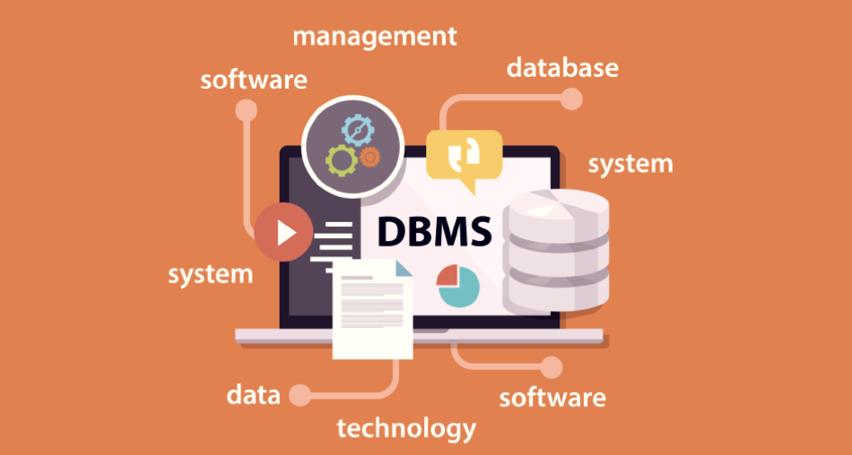

# Note of DBMS 

> image from https://learnsql.com/blog/what-is-dbms/

## Summary Table
| Name | File |
|-|-|
| Relational Algebra | [doc](docs/algebra.md) |
| ER Diagram | [doc](docs/er.md) |
| Proprietaries in DBMS | [doc](docs/proprietary.md) |
| Constraints in DBMS | [doc](docs/constraints.md) |
| Note of SQL | [doc](docs/sql/)|