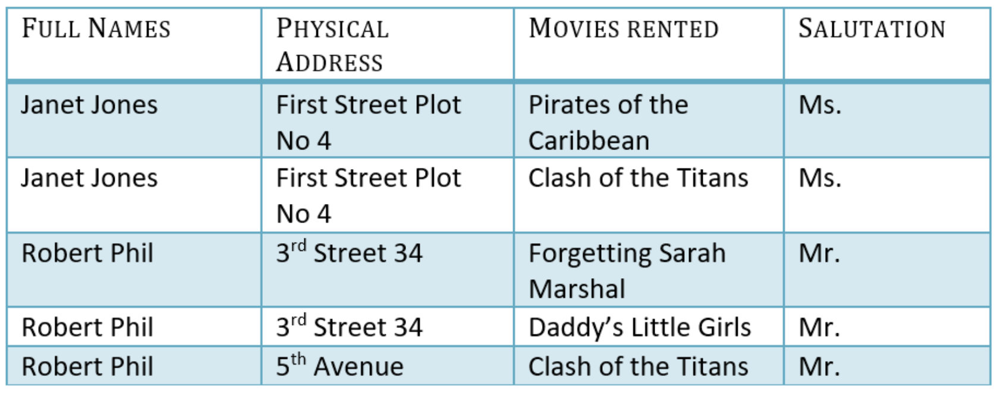
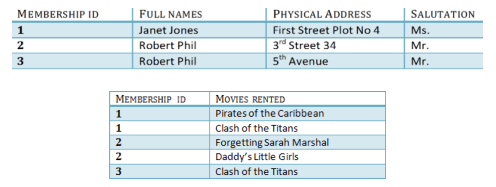
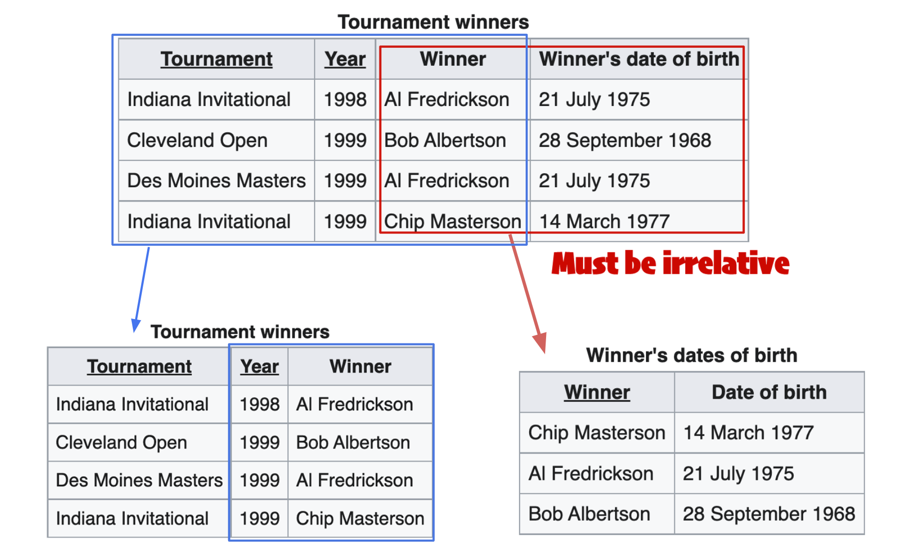

# What is Normalization in DBMS?
Normalization is a database design technique that reduces `data redundancy` and eliminates undesirable `anamalies`.

## What proprietaries should you know about before starting?
- `Keys` and `Dependency`, you can find them from [here](../proprietary.md)

## What is the purpose of Normalization?
The goal of normalization is to decompose a table into `smaller`, `less redundant` tables without losing any of the original data. 
There are several benefits to normalizing a database:
- It reduces `data redundancy`, which can save `storage space` and improve the efficiency of data `manipulation tasks`.
- It makes it easier to add, modify, or delete data, since changes only need to be made in one place.
- It makes it easier to maintain `data integrity`, since the data is stored in a consistent and structured way.
- It makes it easier to query the database, since it reduces **the need for complex joins and subqueries**.

##  Type of Normal Forms
| Form | Definition | Example |
|-|-|-|
| `1 Normal Form, 1NF` | Each table cell should contain a single value. **Each record needs to be unique.** |  |
| `2 Normal Form, 2NF` | 1. `1 Normal Form` must be satisfied.   2. `Non-prime attributes` must have `fully functional dependency` on `Primary Key`.  | In the above example, we can separate the table into to 2 part, one is total depends on `MEMBERSHIP_ID` and the other one is not.  |
| `3 Normal Form, 3NF` | 1. `2 Normal Form` must be statisfied.   2. There are no `transitive dependency` in `non-prime attributes`, which means `non-prime attributes` should be irrelative with each others. | In the example, the `winner` and `winner's date of birth` are relative, which not statisfy `3NF`, so we separte the table as below to make share all `non-prime attributes` only depends on primary key and not related with other `non-prime attributes`     |
| `Boyce-Codd Normal Form, BCNF` | 1. Must statisfy `3 Normal Form`   2. All `functional dependencies` of the table are depend on `candidate key` (subset of `superkey`). | - |