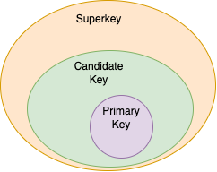

# Proprietary 
## Basic Components
### Keys

| Type of Keys | Definition |
|-|-| 
| `superkey` | A `superkey` is a set of one or more attributes that can uniquely identify a `tuple (row)` in a `relation (table)` |
| `candidate key` | A `candidate key` is a `superkey` for which **no proper subset is superkey**. In other words, a `candidate key` is a `minimal superkey`, meaning it consists of the **minimum number of attributes** needed to uniquely identify a tuple in a relation |
| `primary key` | It's a `candidate key` that is **chosen** by the database designer to be the principal means of identifying tuples in a relation |

### Relational Integrity Constraints
Constraints are **conditions that must hold on all valid relation instances**. There are three main types of constraints.

| Condition | Definition |
|-|-|
| `Key Constraints` | If a relation has several `candidate keys`, one is chosen arbitrarily to be the primary key. The primary key attributes are underlined. |
| `Entity Integrity` | The primary key **cannot have null values** in any tuple of $R$. |
| `Referential Integrity` | Tuples in the $R_1$ have attributes **Foreign Key** that reference the **Primary Key** attributes. |

### Dependency
| Proprietary | Definition |
|-|-|
| `functional dependency` |  It's a relationship between two attributes, typically between the `PK` and other `non-key attributes` within a table. |
| `transitive dependency` | Whenever some **indirect relationship** happens to cause `functional dependency (FC)`. e.g. if $A \rightarrow B$ and $B \rightarrow C$ are true, then $A \rightarrow C$ happens to be a `transitive dependency`.  |

### Protocol
In DBMS, a `protocol` refers to the set of rules or conventions that are followed to ensure that updates to a database are made `consistently` and `correctly`, even in the presence of concurrent access by multiple users or applications.

| Proprietary | Definition |
|-|-|
| `Two-phase locking protocol` | 每一個交易中所有的鎖定動作，必須在所有解除鎖定動作之前。 在交易完成之前，皆保有該交易所需要的鎖定。 兩個 `Phase` 分別為 `growing phase` 與 `shrinking phase` |
| `Time stamping protocol` | 透過交易開始點的時間戳，讓交易的交錯執行擁有順序性 |
| `Optimistic concurrency protocol` | 假設所有交易皆可順利且正確地進行，因此在交易執行過程中不需要作任何的檢查動作 |
| `Shadow paging recovery protocol` | 當交易進行時，若要更新資料庫中的某一磁碟分頁的資料時，會先將要更新得值另外存放到新的磁碟分頁上，而不是直接覆蓋舊磁碟分頁的資料 |

Use Wait-Die and Wound-Wait to prevent deadlock and avoid starvation 

#### Use `Wait-die` and `Wound-wait` to prevent `deadlock` and avoid `starvation`
| Proprietary | Definition |
|-|-|
| `Deadlock` | It's an undesired situation in which two or more transactions have to wait indefinitely for each other in order to get terminated, but none of the transactions is willing to give up the allocated CPU and memory resources that the other one needs. |
| `Starvation` | `Starvation` occurs if a process is `indefinitely postponed`. This may happen if the process requires a resource for execution that it is never alloted or if the process is never provided the processor for some reason. |
| `Wait-Die` | 較早進入的交易可等待，較晚進入的交易被撤回。   假設 ${TS}_1 < {TS}_2$，表示 ${TS}_1$ 是發生在 ${TS}_2$ 之前，那麼當 ${TS}_1$ 要使用 ${TS}_2$ 已經鎖定的資料時，則允許 ${TS}_1$ 繼續等待。 相反的，假設 ${TS}_2$ 要 ${TS}_1$ 已經鎖定的資料時，則 $TS_2$ 必須立即中止執行而死亡，之後再以相同的交易時間戳重新啟動執行以避免`Starvation`問題產生。 |
| `Wound-Wait` | 較早進入的交易可搶較晚進入交易之資源，而較晚進入的交易則需等待。    假設 ${TS}_1 < {TS}_2$，表示 ${TS}_1$ 是發生在 ${TS}_2$ 之前。則 ${TS}_1$ 要使用 ${TS}_2$ 鎖定的資料時，則${TS}_2$ 必須立即中止執行，而後再以相同時間戳重新啟動執行，從而避免 `Starvation` 產生。相反地，假設 ${TS}_2$ 要使用 ${TS}_1$ 已經鎖定的資料時，則 ${TS_2}$ 必須繼續等待 |

## Difficulty in DBMS
| Proprietary | Definition |
|-|-|
| `Data integrity` | The state of being `whole` and `undivided` of schema. |
| `Impedance mismatch` | 由於 Database 上的 data model 和程式語言的 data model 不相符合，無法 匹配所引發的問題 |
| `Cascading rollback` | 某筆交易的 rollback 可能會影響到其他交易也要跟著 rollback 的現象 |

## Transactions
A `transaction` is an event which occurs on the database. Generally a `transaction` reads a value from the database or writes a value to the database. A transaction is analogous to processes in Operating Systems.
| Proprietary | Definition |
|-|-|
| `Serializabitlity` | 可序列化排程. 一個具有 $n$ 筆交易的排程與相同的 $n$ 筆交易所構成之某一 `序列(Serial)` 排程 `等價(Equivalent)` |
| `BFIM` | The image of database before the transaction |
| `AFIM` | The image of database after the transaction |
| `Write-ahead log` | The log entry must **be flushed(刷新) to disk** before `BFIM` is overwritten with `AFIM` |

## Normalization
Normalization is a database design technique that reduces data redundancy and eliminates undesirable anamalies. see [here](./normalization/)

## Others
| Proprietary | Definition |
|-|-|
| `Parametric End Users` | `Parametric End Users` are the unsophisticated(樸實無華) who don't have any DBMS knowledge but they frequently use the database applications in their daily life to get the desired results. For examples, Railway's ticket booking users are naive users.  (中：不具有DBMS相關知識但經常使用資料庫為基礎的應用程式的用戶) |
| `Views` | A database view is **a subset of a database and is based on a query** that runs on one or more database tables.   (中： View是基於 query 資料庫的子集) |
| `Support of mutiple views of the data` | - Each user may see a different view of the database, which describes only the data of interest to that user   - It may also contain some **virtual data that is derived from the database files but its not explicitly stored**.   (中：每個用戶都擁有各自的資料庫視圖。且可能含有由資料庫內資料所推導出來的虛擬資料) |
| `Program-data independence` | The ability to modify the scheme without affecting the programs and the application to be rewritten.   Data is separated from the programs, so that the changes made to the data will **not affect the program execution and the application**.   (中：對數據做的改變不會影響應用的執行) |
