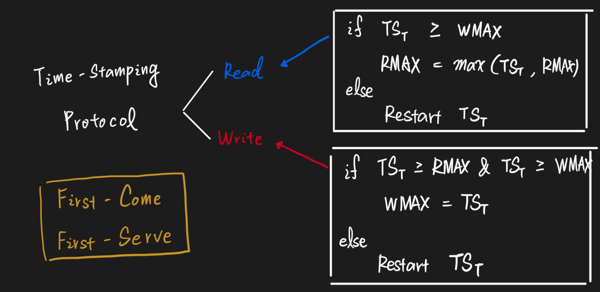

# Protocol
In DBMS, a protocol refers to the set of rules or conventions that are followed to ensure that updates to a database are made consistently and correctly, even in the presence of concurrent access by multiple users or applications.

## Basic Proprietaries in Protocol
| Proprietary | Definition |
|-|-|
| `Deadlock` | It's an undesired situation in which two or more transactions have to wait indefinitely for each other in order to get terminated, but none of the transactions is willing to give up the allocated CPU and memory resources that the other one needs. |
| `Starvation` | `Starvation` occurs if a process is `indefinitely postponed`. This may happen if the process requires a resource for execution that it is never alloted or if the process is never provided the processor for some reason. |
| `Serializability` | 可序列化排程. 一個具有 $n$ 筆交易的排程與相同的 $n$ 筆交易所構成之某一 `序列(Serial)` 排程 `等價(Equivalent)` |

## How to ensure Serializability
### Using Two-phase Locking Protocol(2PL)?

- 每一個交易中所有的鎖定動作，必須在所有解除鎖定動作之前。 在交易完成之前，皆保有該交易所需要的鎖定。 兩個 Phase 分別為 growing phase 與 shrinking phase。
    - 若在 Read 與 Write 前均能成功 lock 住相關項目，則能確保此異動在執行時不會有更新異常。
    - 但由於已 lock 住項目，即便期間有其他異動在進行，也須等到 lock 的異動釋出後才能正常執行
- Proprietary
    | Proprietary | Definition |
    |-|-|
    | `Growing Phase`   | 僅 `lock` 項目，不能 `unlock`  |
    | `Shrinking Phase` | 僅 `unlock` 項目，不能 `lock` |
- Analysis
    | Analysis | Description |
    |-|-|
    | Strength | Ensure `Serializable` |
    | Weakness | It might cause `deadlock` or `livelock` when a locking takes too long. |

### Using Time-stamping Protocol?

透過交易開始點的時間戳，讓交易的交錯執行擁有順序性

| Analysis | Description |
|-|-|
| Strength | Ensure `Serializable` and there is no need to lock data terms, so `deadlock` won't have happened. |
| Weakness | It might cause `cascading rollback`, lower the efficiency. |

### Using Optimistic-concurrency Protocol?

- 透過 Read Phase, Validation Phase, Write Phase 來確保 `Serializable`
- 假設所有交易皆可順利且正確地進行，因此在交易執行過程中不需要作任何的檢查動作
- Analysis
    | Analysis | Description |
    |-|-|
    | Strength | Ensure `Serializable` and avoid `deadlock`.   If there is no `inconsistency`, the efficiency can be boost.   |
    | Weakness | `Inconsistencies` occur frequently, resulting in a large number of `undos` or `reverts` Work |

### Using Shadow Paging Recovery Protocol 

當交易進行時，若要更新資料庫中的某一磁碟分頁的資料時，會先將要更新得值另外存放到新的磁碟分頁上，而不是直接覆蓋舊磁碟分頁的資料
- Proprietary
    | Proprietary | Definition |
    |-|-|
    | `Shadow Page` | 指向交易前的原磁碟分頁資料，使用硬碟 |
    | `Current Page` | 指像交易執行期間的目前磁碟分頁資料，使用記憶體 |
- Analysis
    | Analysis | Description |
    |-|-|
    | Strength | `No-redo, No-undo`, so it saves time during `recovery`  |
    | Weakness | Waste storage space, and need to do `garbage collection` |

### Using `wait-die` and `wound-wait` to prevent `deadlock` and avoid `starvation`
| Proprietary | Definition | Preemptive |
|-|-|-|
| `wait-die` | 較早進入的交易可等待，較晚進入的交易被撤回。   假設 ${TS}_1 < {TS}_2$，表示 ${TS}_1$ 是發生在 ${TS}_2$ 之前，那麼當 ${TS}_1$ 要使用 ${TS}_2$ 已經鎖定的資料時，則允許 ${TS}_1$ 繼續等待。 相反的，假設 ${TS}_2$ 要 ${TS}_1$ 已經鎖定的資料時，則 $TS_2$ 必須立即中止執行而死亡，之後再以相同的交易時間戳重新啟動執行以避免`Starvation`問題產生。 | `non-preemptive` |
| `wound-wait` | 較早進入的交易可搶較晚進入交易之資源，而較晚進入的交易則需等待。    假設 ${TS}_1 < {TS}_2$，表示 ${TS}_1$ 是發生在 ${TS}_2$ 之前。則 ${TS}_1$ 要使用 ${TS}_2$ 鎖定的資料時，則${TS}_2$ 必須立即中止執行，而後再以相同時間戳重新啟動執行，從而避免 `Starvation` 產生。相反地，假設 ${TS}_2$ 要使用 ${TS}_1$ 已經鎖定的資料時，則 ${TS_2}$ 必須繼續等待 | `preemptive` |

- The diffirence between `wait-die` and `wound-wait`
In `wait-die`, The newer transactions are killed when **the newer transaction makes a request** for a lock being held by an older transactions. 
In `wound-wait`, The newer transactions are killed when **an older transaction makes a request** for a lock being held by the newer transactions.

    | | $T_n$ is older than $T_k$ | $T_n$ is younger than $T_k$ |
    |-|-|-|
    | wait-die   | $T_n$ waits | $T_n$ dies|
    | wound-wait | $T_k$ aborts| $T_k$ waits|