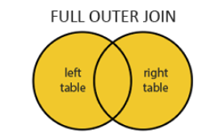

## SQL JOINS

### Types of Outer Join
| Type | Symbol | illustration |
|-|-|-|
| Full Outer Join | $R_1$ ⟗ $R_2$ ||
| Right Outer Join | $R_1$ ⟖ $R_2$ ||
| Left Outer Join |  $R_1$ ⟕ $R_2$ |  |

### Compare with different Join methods
| Context | Note |
|-|-|
| **Inner Join** vs **Intersection** | They are very different, even in your case. The INNER JOIN will return duplicates, if id is duplicated in either table. INTERSECT removes duplicates. The INNER JOIN will never return NULL , but INTERSECT will return NULL . |
| **Full Outer Join** vs **Union** | They're completely different things. A join allows you to relate similar data in different tables. A union returns the results of two different queries as a single recordset. |
